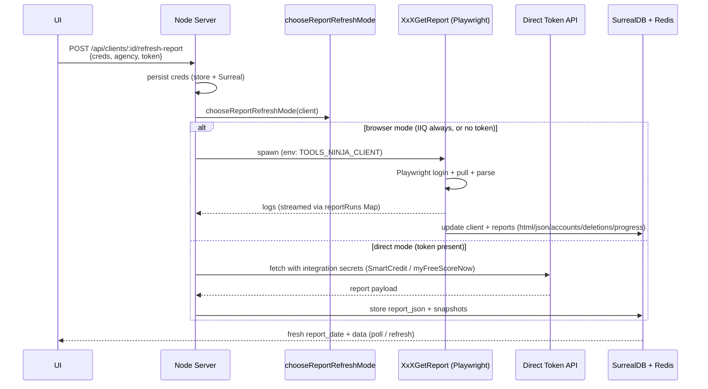
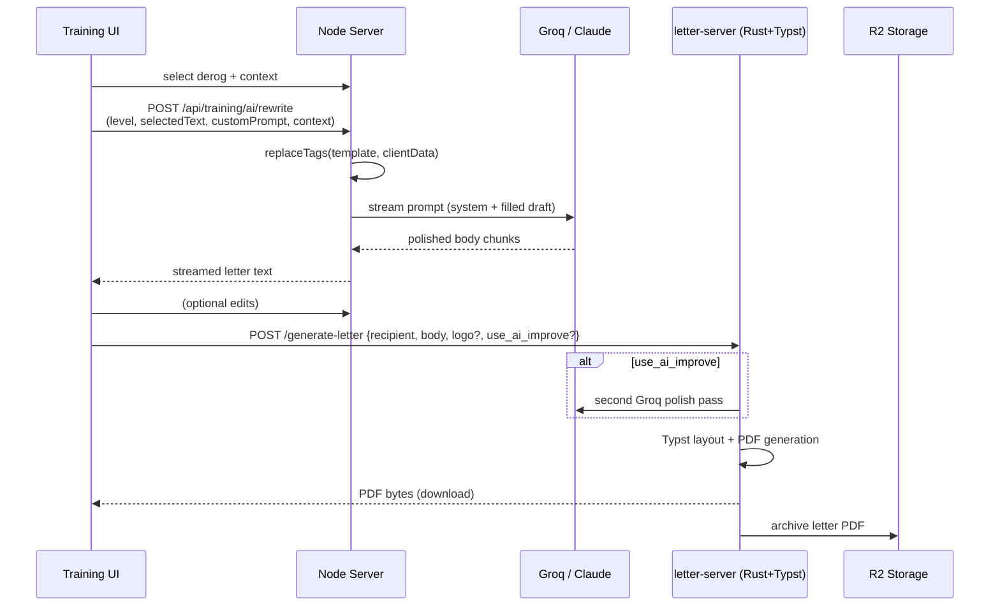

# NinjaCore (NinjaTools) Architecture — Current State

**Project**: NinjaDispute credit repair & dispute automation platform tooling  
**Primary Workspace**: `/Users/drewdrew/NinjaTools` (Node.js core server + tooling)  
**Live Server**: Hetzner VPS (5.78.214.176) — `ninjacore.ninjadispute.com`  
**Status (as of 2026)**: Production system with ongoing SurrealDB consolidation + parallel rewrite experiments. 12k+ LOC Node monolith + rich automation scripts.

This document describes the **actual running architecture** in the workspace and deployed system (Node-based). A previous version of this file described a target SvelteKit + Rust Axum rewrite; that target state is now summarized in the "Future / Parallel Efforts" section.

---

## 1. High-Level Overview

NinjaCore is the operational backend and automation suite for a credit repair business. It ingests consumer credit reports, maintains client state, generates professional dispute letters (AI-assisted + typographically rendered PDFs), drives payment/subscription billing, and automates dispute submission via browser agents.

**Core Philosophy (pragmatic ops-first)**:
- Fast iteration over clean architecture.
- Hybrid access: browser automation when APIs are fragile or absent; direct token/API when reliable.
- Heavy use of one-off scripts + a desktop launcher for the operations team.
- Single source of truth migration in progress (SurrealDB).

```mermaid
flowchart TB
  Ops[Operators / UI\nDashboard + Script Launcher + Training]
  Server[Node Core Server\n:3017\nserver.mjs monolith]
  Launcher[Electron\nScript Launcher]
  Letter[Rust Letter Server\n:8080 + Typst]
  PW[Playwright\nReport Pulls\n(XxXGetReport)]
  DF[Dispute Fox\nAutomation\n(Playwright+CDP+CV)]
  DB[(SurrealDB\nHetzner\nninja/dispute)]
  Redis[(Redis\nCache)]
  R2[(R2 / S3\nReports + Letters)]
  Pay[Payment Gateways\nNMI/Square + Webhooks]

  Ops -->|interact| Server
  Ops -->|launch| Launcher
  Launcher -->|spawns| PW
  Launcher -->|spawns| DF
  Server -->|spawns / orchestrates| PW
  Server -->|POST render| Letter
  Letter -->|optional Groq| Letter
  PW -->|update| DB
  DF -->|update| DB
  Server <-->|queries + cache| Redis
  Server <-->|sync + read/write| DB
  Server -->|proxy / archive| R2
  Letter -->|save PDFs| R2
  Server <-->|webhooks / API| Pay
```

*ASCII fallback for environments without Mermaid: see previous version or render the diagram above.*

---

## 2. Core Components

### 2.1 Node.js Monolith Server (`server.mjs`, ~12,659 LOC)

- Pure Node `http` + `socket.io` (very little framework).
- Custom route matcher (`routes/index.mjs` + modules for auth, health, business).
- Most business logic still lives in giant `if (pathname === ...)` blocks inside the request listener (started extraction but incomplete).
- **Responsibilities**:
  - Client CRUD + search (in-memory store.json synced to Surreal).
  - Report refresh orchestration (browser spawn vs direct token API).
  - Training / AI rewrite endpoints (streams from Groq, persists context).
  - Document + thumbnail proxy (to R2/local).
  - Static file serving (with custom critical/deferred CSS split, lazy bundles).
  - Auth (legacy cookie + modern Google/GitHub OAuth + app login).
  - GHL webhooks, payment events, billing pages.
  - Spawns long-running report jobs and streams logs via `reportRuns` Map (polled by UI + Socket.IO readiness).
- Uses `AsyncLocalStorage` for per-request owner scoping (`txn` cookie / username).
- Redis for hot-path caching (`lib/cache.mjs`): AI result cache, report data (per-client/source + memoizeReportFetch for monitoring fetches with 30min TTL), used by server for expensive refresh paths. (The more advanced `fastQuery` + single-flight Surreal client wrapper is live on the Contabo Express bridge side per recent session notes.)

**Key entry**: `npm start` (builds then `node server.mjs`).

### 2.2 Frontend (Vanilla Multi-Page + Bundles)

- Served from `public/` + `dist/` (esbuild bundles).
- "Pages": `/` (clients hub — main working view), `/billing`, `/payments`, `/training` (or `/learning`), `/add-clients`, etc.
- Heavy vanilla JS (app.js, billing.js, payments.js, full-disputes.js, features/*.js).
- Recent code-splitting work: critical CSS first, deferred CSS lazy-loaded, separate bundles per section.
- Some modern libs pulled in root package.json (minisearch, @tanstack/svelte-*) — used by experimental Svelte or for future.
- No full SPA framework in the live frontend; page loads or hash/fragment navigation in places.

**Build**: `build.mjs` (esbuild for JS, custom critical CSS extractor, lazy-loader.js).

### 2.3 Script Launcher (Electron)

- `ScriptLauncher-Electron/`: desktop control center.
- Reads `scripts.json` (array of `{label, type: 'node'|'command', target, cwd, ...}`).
- Buttons spawn child processes (node scripts, shells), capture + display stdout/stderr.
- Currently many entries point at backup dirs (`record-scripts/electron-app.backup-*`) — indicates rapid iteration and frequent forking of the fragile automation layer.

### 2.4 Report Ingestion (`scripts/XxXGetReport-NinjaTools.mjs` + variants)

The heart of the system.

- Spawned by server on `/api/clients/:id/refresh-report`.
- Supports two modes per agency (chosen by `chooseReportRefreshMode`):
  - **browser** (Playwright): IdentityIQ always; SmartCredit / myFreeScoreNow when no token.
  - **direct** (token/API): SmartCredit (PIDs 35540/68951), myFreeScoreNow when `monitoringToken` present.
- Sophisticated bot detection evasion, JSONP unwrapping, dual routing (whitelist vs primary), detailed page summarization logging.
- On completion: client + report records updated (HTML/JSON snapshots, accounts, deletions, progress).

Many timestamped backup variants of this script exist (sign of high change velocity).

### 2.5 Dispute Automation ("Dispute Fox")

- Lives primarily outside the NinjaTools tree (historically `electron-app/`, `record-scripts/electron-app.*`, Desktop/Scripts/ etc.).
- Playwright + Chrome DevTools Protocol (CDP) + OpenCV (image anchoring/cropping for form fields).
- Family of `XxXDispute-Fox-Auto*.mjs` scripts.
- Launched via Script Launcher or directly.
- Extremely fragile surface (bureau sites change often) → many experimental forks/backups.

### 2.6 Letter Generation Pipeline

Two-stage:

1. **Drafting** (`ai/` + server `/api/training/ai/rewrite`):
   - `letterGenerator.ts` + `groq.ts` / `claude.ts` (streaming).
   - `replaceTags.ts` for client data injection into templates.
   - Training UI (`/training`) lets operators select derogatories + context, iterate rewrites at different "levels".
   - Context sessions stored per-owner in memory (and Surreal `templates`/`paragraphs`).

2. **Professional Render** (`letter-server/` — Rust + Actix-web + Typst):
   - POST `/generate-letter` with recipient/sender/subject/body + optional logo/signature base64.
   - Optional second Groq pass (`use_ai_improve`).
   - Typst templates produce clean, consistent PDFs.
   - Output saved to R2 (letters retrievable via `extraInfo` / folder dir shims).

Clean separation: Node owns domain/AI drafting + templates; Rust owns beautiful PDF production.

### 2.7 Billing & Payments

- UI: `/billing` and `/payments` (served + bundled).
- NMI as primary gateway (Collect.js hosted fields in related `nmi-vault-*` projects at sibling dirs).
- Webhooks from GHL + Square/NMI → stored in Surreal `payment_events`, `merchants`, `products`, `autopay`.
- Failed payment recovery flows (BTCP scripts in sibling dirs, matching, retry logic).
- Separate vault microservice (C# / .NET on NmiVault) for token storage + subscriptions.

Server has integration config loading and processor-specific handling.

### 2.8 Data & Sync Layer

**Primary**: SurrealDB (remote Hetzner, namespace `ninja`, database `dispute`).

**Consolidation (major 2026-05 work)**:
- Previously two sources: "ninjatools" (local/older MySQL + store.json) + "api" (Contabo MySQL/Express/Vue).
- Now unified on single Hetzner Surreal.
- `scripts/surreal-schema.surql` (SCHEMAFULL) defines merged tables:
  - `clients` (central, with `client_bin` 170-byte SIMD-friendly packed blob, AES-GCM encrypted SSN fields, `source_db`, many monitoring_* fields).
  - `reports`, `templates`, `paragraphs`, `users`, `settings`.
  - Payment domain: `merchants`, `products`, `autopay`, `payment_events`.
  - Legacy parallel tables kept for bridge: `api_reports`, `report_data_entries`, `extra_infos`, `api_users`, etc.
  - `sync_state` tracks last sync timestamps per source/table.
- Many one-off migration scripts (`migrate-*.mjs`, `sync-to-surreal.mjs`, `patch-server-surreal*.mjs`, dedup, backfill encrypt SSN, etc.).
- Local `data/store.json` + `data/users/` still used for some dev / fallback.
- Redis cache in front of Surreal for hot reads (`fastQuery`, 60s TTL, single-flight).

Document resolver + report resolver shims in other deployments (Contabo Express) to present unified shape.

### 2.9 Storage

- Local filesystem on VPS for latest reports (`report_local_path`).
- R2 (Contabo S3-compatible) for archived reports, letters, documents (`report_r2_key`, proxy routes).
- Upload dirs under `public/uploads/`.

---

## 3. Key Data Flows

### 3.1 Client Refresh (Report Ingestion)



After run: UI polls or receives update; client now has fresh `report_date`, linked report. (The `reportRuns` in-memory map + Socket.IO is used for live log observation during long browser runs.)

### 3.2 Letter Draft → Professional PDF



Templates + paragraphs live in Surreal (per-bureau JSON blobs in `templates` / `paragraphs` tables).

### 3.3 Billing / Failed Payment Recovery (simplified)

- External (GHL/Square/NMI) webhooks → server → `payment_events` + update `autopay`.
- UI shows failed payments; ops use BTCP scripts (sibling) for Airtable/GoHighLevel matching, retries, contact sync.
- Autopay engine (future/partial) would use `next_charge_at` + merchant creds.

---

## 4. Sub-Projects & Directory Map (NinjaTools focus)

| Path                        | Purpose / Tech                              | Notes |
|-----------------------------|---------------------------------------------|-------|
| `server.mjs` + `routes/`    | Core HTTP API + static serving (Node)      | 12k LOC monolith |
| `public/` + `dist/`         | Vanilla frontend bundles                    | Clients hub primary |
| `build.mjs`                 | esbuild + critical CSS splitter             | Produces dist/ |
| `ai/`                       | Groq/Claude letter gen + tag replacement    | Streaming |
| `letter-server/`            | Rust Actix + Typst PDF renderer             | Cargo, optional Groq polish |
| `scripts/`                  | 70+ automation, migration, sync scripts     | XxXGetReport main; many migrate-* |
| `ScriptLauncher-Electron/`  | Electron button launcher for scripts        | scripts.json driven |
| `FRONT-END/`                | Experimental SvelteKit 5 + TanStack Query/Virtual + MiniSearch | Talks Unix socket to future Rust backend |
| `lib/cache.mjs`             | Redis + memoize helpers                     | Report + query caching |
| `data/`                     | Local store.json + user data                | Legacy / dev fallback |
| `electron-app/` (sibling)   | Dispute Fox browser automation              | Many backup forks elsewhere |
| `nmi-vault-*` (sibling)     | .NET + React billing vault                  | NMI tokenization + SaaS |

Outside but related: `Desktop/Scripts/`, `Desktop/TexasCreditFix/`, `playwright-control/`, `BTCP-Failed-Payment-Script/`, Contabo "api" Express/Vue deployment, Hetzner Rust ninjacore attempts.

---

## 5. Technology Stack

- **Runtime**: Node.js (ESM), Rust (letter-server + experimental ninjacore), Python (some vantage/models)
- **DB**: SurrealDB v3 (HTTP, SCHEMAFULL), Redis (cache), legacy MySQL (migration source)
- **Automation**: Playwright 1.59 (browser report + disputes), CDP, sharp (images), OpenCV via Python?
- **AI**: Groq (llama-3.3-70b-versatile primary), Anthropic, optional Claude
- **PDF**: Typst (via typst-as-lib in Rust)
- **Frontend**: Vanilla JS + esbuild bundles; experimental Svelte 5 + Tailwind v4 Oxide + TanStack
- **Auth**: Legacy passwords, Google/GitHub OAuth, Paseto in Rust experiments, cookies
- **Deploy**: rsync + sshpass (from Mac), systemd services (`ninjacore-web`, surreal), live patches, Caddy on some paths
- **Other**: Socket.IO (light), minisearch (client search experiments), dotenv

---

## 6. Deployment & Operations

- **Local dev**: `npm start` (build + server on 3017). Letter server separate `cargo run`. Script Launcher `npm start` in its dir.
- **Live (Hetzner)**: `npm run build:deploy` or git-pull hook → rsync dist/ + html/js → restart `ninjacore-web.service`. Uses sshpass with password in script (see security).
- **Live patches**: `_live_patch/`, `deploy/` dir with systemd units, Caddyfiles.
- **Surreal**: `fix-surrealdb.sh`, `surrealdb.service`, schema apply scripts.
- **Multiple environments**: Local Mac, Hetzner (primary Surreal + Node), Contabo (legacy api + some read paths + Tailscale tunnel for cross-DC).
- **Backups**: `_backups/`, timestamped script copies, DB dumps to R2.
- **Hot paths observed**: Report jobs (long-running, log streaming), client list loads (cached), letter renders.

See `DEPLOYMENT_GUIDE.md`, `DEPLOY*.sh`, `SESSION_2026-05-27.md` for recent bridge work.

---

## 7. Security & Credentials Notes

**High-value assets**:
- Monitoring agency logins/tokens (SmartCredit, IdentityIQ, myFreeScoreNow) — stored encrypted SSN + monitoring_* on clients + integration secrets.
- Payment gateway creds (NMI api keys, Square, etc.).
- R2/S3 keys, Surreal auth.

**Observed issues (typical for this velocity)**:
- Fallback defaults in code: `Texas123!`, `abay@gmail.com` etc.
- `sshpass -p 'Malachi77'` hardcoded in `deploy.sh`.
- Many backup files with potentially old creds in git history or Desktop/.
- Legacy store.json + data/users/ with hashes (salted sha256) alongside newer Surreal users.
- No comprehensive secret scanning or rotation policy visible.
- Apple OAuth / SSO fixes in dedicated scripts (recent work).
- CORS whitelist + localhost exceptions.

**Strengths**:
- Surreal namespacing.
- Per-owner scoping via AsyncLocalStorage + cookies.
- AES-GCM for SSN in `client_bin` + separate iv/tag.
- Document proxy (no direct client exposure of storage keys in some paths).

**Recommendation**: Dedicated credential audit + vaulting of all integration secrets (the NMI Vault work is partial step).

---

## 8. Technical Debt & Observations

**Strengths**:
- Extremely deep domain encoding in the automation scripts (report parsing, form filling, letter templates).
- Pragmatic hybrid (browser + API) keeps the business running when sites change.
- Script Launcher dramatically improves ops velocity.
- Clean letter pipeline split (AI draft vs professional render).
- Major consolidation progress onto Surreal (single source of truth emerging).

**Debt / Risks**:
- `server.mjs` is a 12k LOC God file. Partial route extraction exists but most handlers remain inline.
- Automation layer (Dispute Fox / report scripts) has dozens of backup forks; hard to know "the one true version".
- Script paths in `scripts.json` often point at `*.backup-*` dirs — fragile.
- Frontend is "good enough" vanilla but not a joy to maintain; two experimental frontends (Svelte, prior Vue on Contabo).
- No tests visible at root (some Playwright specs?).
- Deployment relies on sshpass + known passwords; no zero-downtime or proper secrets.
- Real-time is polling + log scraping (Socket.IO present but underused).
- Data shape still carries legacy dual-source fields (source_db, parallel api_* tables).
- Many one-off migration scripts not yet deleted/ archived.

**Highest-ROI opportunities** (from study synthesis):
1. Finish stabilizing the report/dispute scripts into a clear "current" set + retire backups.
2. Extract more route domains from server.mjs (clients, reports, training, payments, integrations).
3. Make Script Launcher the source of truth for script inventory (or generate it).
4. Credential isolation + rotation (finish vault integration).
5. Observability around long-running jobs (better than in-memory Map + poll).
6. Decide on frontend direction (invest in SvelteKit target or improve current vanilla).
7. Clean up the monorepo layout (NinjaTools vs siblings vs Desktop).

---

## 9. Future / Parallel Efforts (Target State Described in Prior ARCHITECTURE.md)

- **Rust backend** ("ninjacore" Axum): Unix domain sockets for 0-latency, Paseto auth, SCHEMAFULL Surreal, high perf.
- **SvelteKit + Svelte 5 frontend** (`FRONT-END/`): TanStack Query + Virtual + MiniSearch (Web Worker), Tailwind v4 Oxide, Unix socket IPC to backend.
- Full consolidation: retire Contabo legacy paths, delete parallel tables once parity proven.
- Possible Bun runtime experiments.
- Better caching, HTTP/3 via Caddy, structured deployment (systemd + Caddyfiles already partially present).

Current live traffic and ops still run on the Node + vanilla system described above. The Rust/Svelte work is advanced scaffolding + partial prod experiments.

---

## 10. Quick Start (Local)

```bash
cd NinjaTools
npm install
npm start                 # builds + runs Node on :3017

# In another terminal (letter PDFs)
cd letter-server
source "$HOME/.cargo/env"
cargo run                 # :8080

# Script launcher (desktop)
cd ScriptLauncher-Electron
npm start
```

Surreal must be reachable (or use local for dev); set env for GROQ etc. as needed.

---

**Maintained as living doc**. Update when major flows, schema, or subsystem boundaries change. For deep dives see:
- `SESSION_2026-05-27.md` (Surreal bridge)
- `scripts/surreal-schema.surql`
- `DEPLOYMENT_GUIDE.md`
- Individual script headers and server.mjs comments around key functions (`chooseReportRefreshMode`, report run, AI rewrite, etc.).

*Generated from codebase study + direct inspection (server.mjs, schema, scripts, deploys, subprojects).*
